# Mermaid Design 🎨

**Editorial-quality diagrams as portable Mermaid code.**

Eleven diagram types. One shared design system, complexity budget, and taste gate. Renders everywhere — GitHub, Notion, Obsidian, GitLab, VS Code, and any Markdown viewer that supports Mermaid.

Inspired by [cathrynlavery/diagram-design](https://github.com/cathrynlavery/diagram-design) — editorial diagram philosophy adapted for Mermaid.js.

---

## What it makes

| Type | Best for | Mermaid syntax |
|---|---|---|
| **Flowchart** | Decision logic, algorithms, branching flows | `graph TD` |
| **Sequence** | Request/response, protocol exchanges, API traces | `sequenceDiagram` |
| **Architecture** | System overviews, data-flow, integration maps | `graph LR` / `architecture-beta` |
| **State machine** | Order status, auth state, connection lifecycle | `stateDiagram-v2` |
| **ER / data model** | Database schemas, API resource relationships | `erDiagram` |
| **Timeline** | Release history, milestones, roadmaps | `timeline` |
| **Quadrant** | Prioritization, 2×2 positioning, portfolio maps | `quadrantChart` |
| **Tree** | Org charts, dependency trees, taxonomy | `graph TD` / `mindmap` |
| **Swimlane** | Cross-functional processes, handoffs | `graph TD` + `subgraph` |
| **Layer stack** | OSI model, tech stack, abstraction layers | `graph TB` / `block-beta` |
| **Nested** | Scope boundaries, containment hierarchies | `graph TD` + `subgraph` |

All diagrams ship with an editorial palette (warm paper, ink, coral accent) and a pre-output taste gate.

---

## Install

This skill uses the **open SKILL.md standard** — a single `SKILL.md` file with YAML frontmatter inside a named folder. Works natively across Claude Code, OpenCode, GitHub Copilot CLI (Codex), Antigravity, and any other agent that follows the same convention. No separate versions needed.

### Claude Code
```bash
git clone git@github.com:iamvaleriofantozzi/mermaid-design.git ~/.claude/skills/mermaid-design
```
Restart Claude Code. The skill registers as `mermaid-design`.

### OpenCode / Paseo
```bash
git clone git@github.com:iamvaleriofantozzi/mermaid-design.git ~/.config/opencode/skills/mermaid-design
# or symlink from Claude Code
ln -s ~/.claude/skills/mermaid-design ~/.config/opencode/skills/mermaid-design
```

### GitHub Copilot CLI (Codex)
```bash
# Project-level
git clone git@github.com:iamvaleriofantozzi/mermaid-design.git .github/skills/mermaid-design
# Personal (global)
git clone git@github.com:iamvaleriofantozzi/mermaid-design.git ~/.copilot/skills/mermaid-design
```

### Antigravity
```bash
git clone git@github.com:iamvaleriofantozzi/mermaid-design.git .agents/skills/mermaid-design
```

### Manual use
Copy any example below and paste it into the [Mermaid Live Editor](https://mermaid.live/).

---

## Quickstart

```
Make me a flowchart of the login flow: start, validate input, check credentials,
return token or error.
```

Your agent picks the right type, builds the Mermaid code, and outputs it wrapped in triple backticks. Paste it into any Mermaid-compatible viewer.

```
Make me a sequence diagram of the OAuth handshake in dark mode.
```

The agent uses the dark token palette and sets the init block accordingly.

---

## Examples

### Flowchart — Login flow with validation

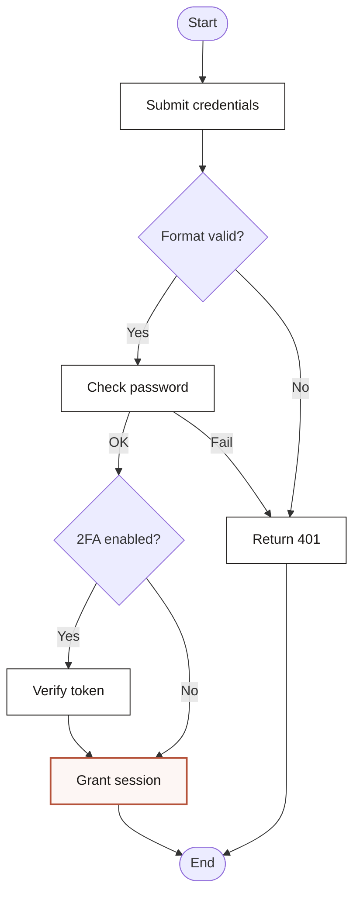

### Sequence — OAuth2 handshake

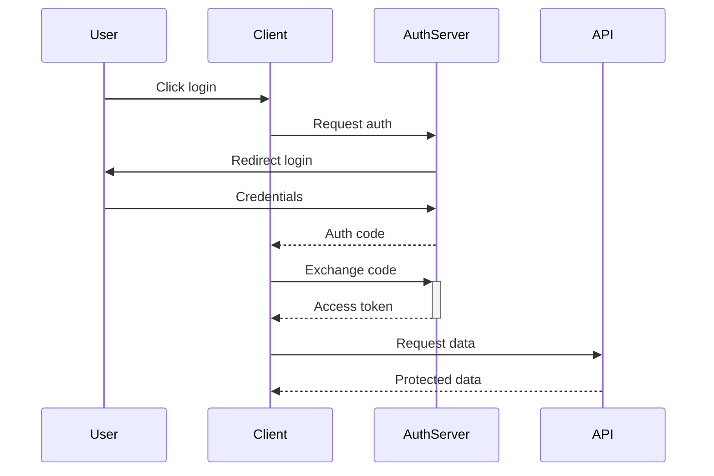

### Architecture — Web app stack

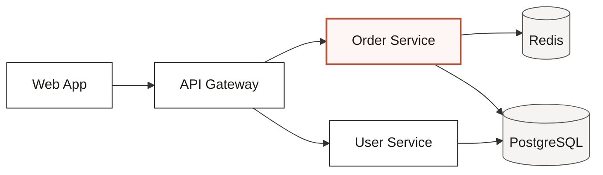

### State — Order lifecycle

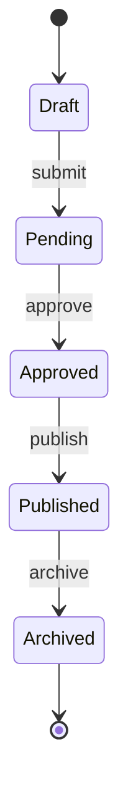

### ER — E-commerce model

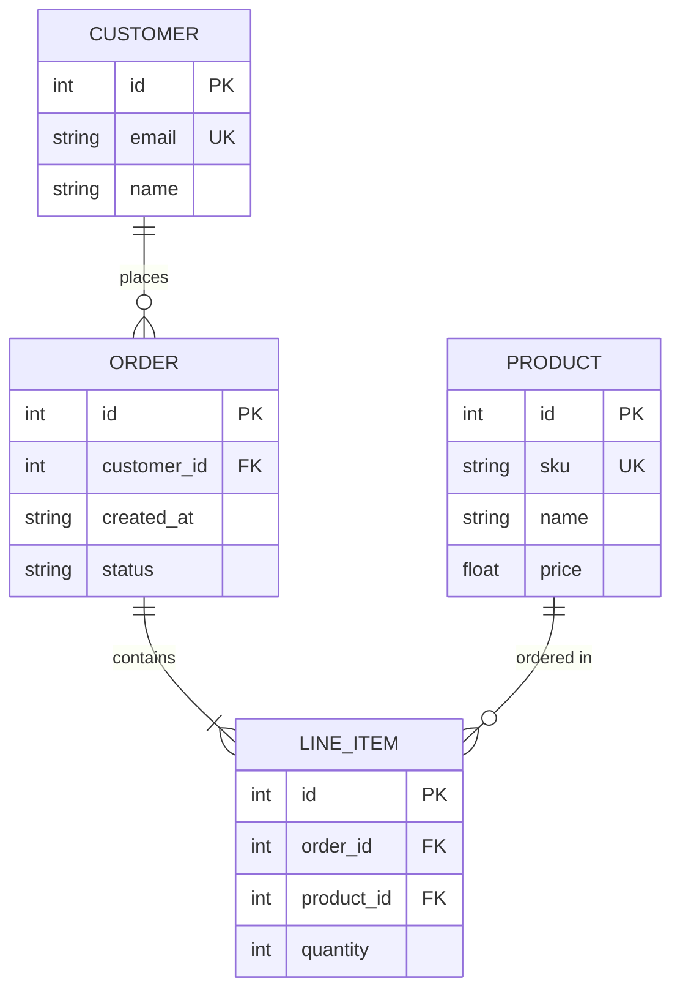

### Timeline — Product roadmap

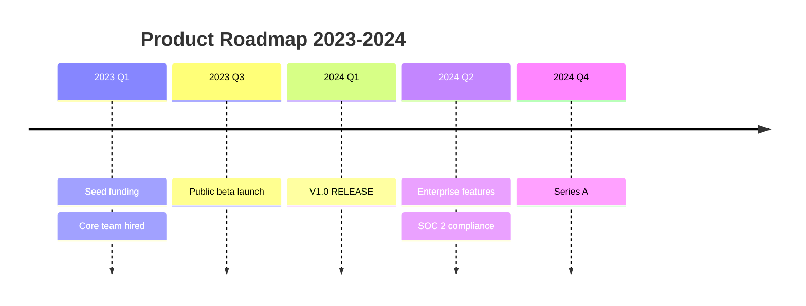

### Quadrant — Q2 prioritization

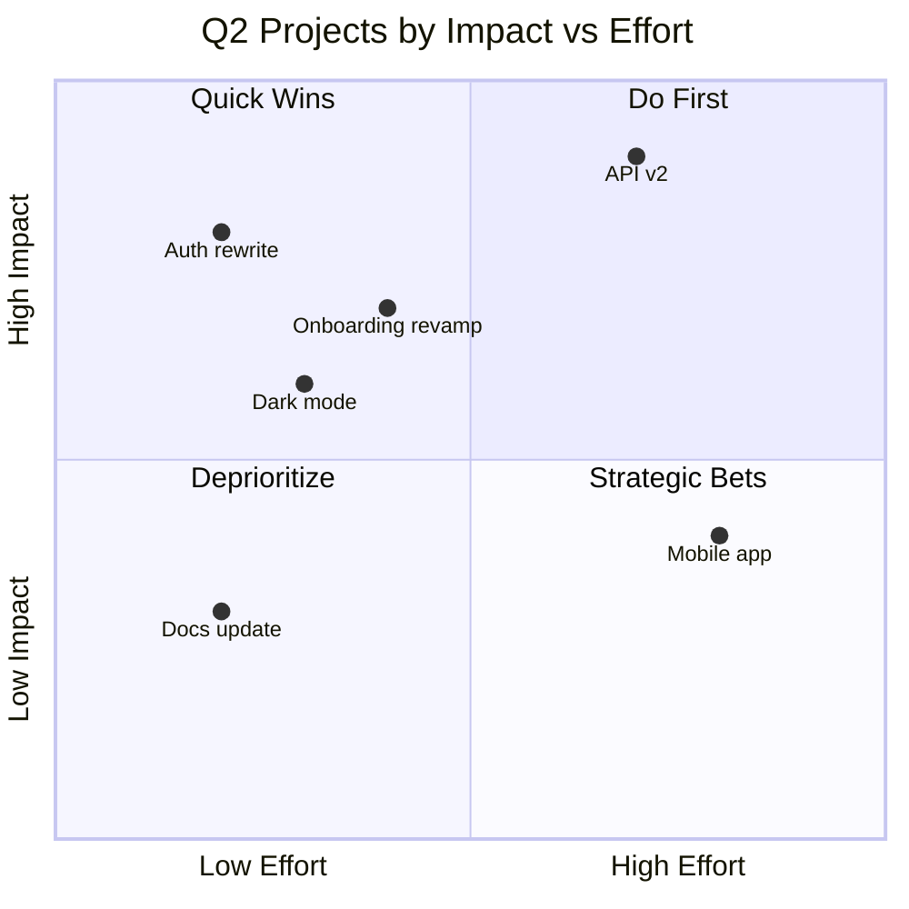

### Tree — API gateway dependencies

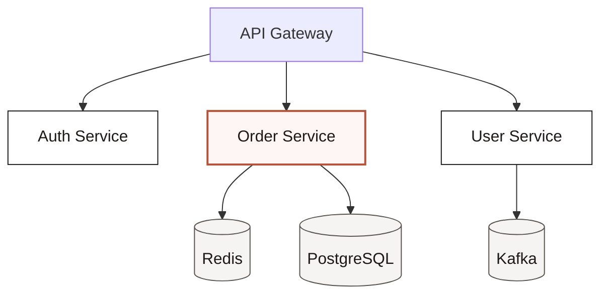

### Swimlane — Feature delivery

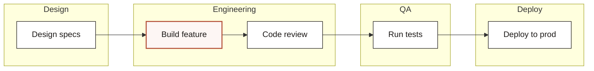

### Layer stack — Full-stack layers

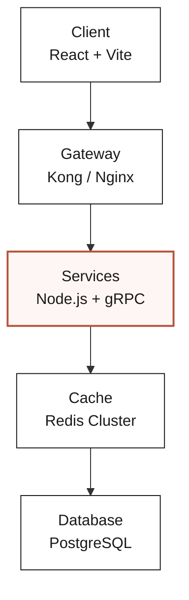

### Nested — Config cascade

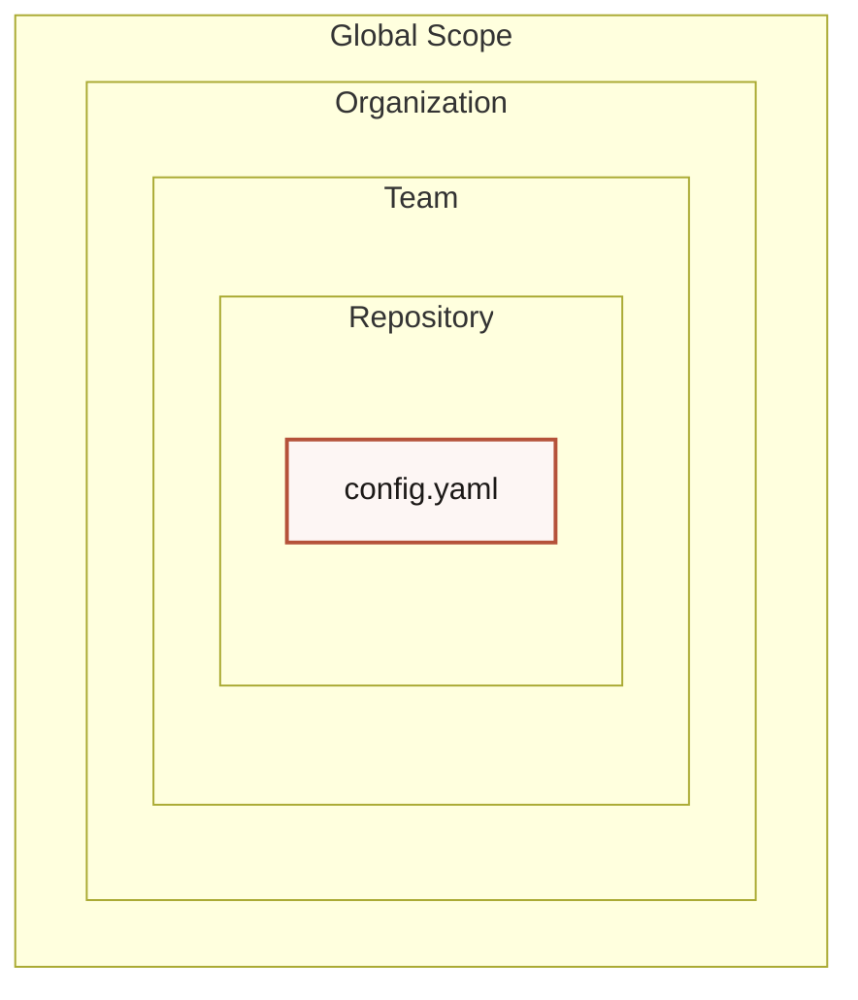

---

## Viewer compatibility

| Feature | GitHub | Notion | Obsidian | GitLab | VS Code |
|---|---|---|---|---|---|
| `%%{init}%%` | ✅ | ✅ | ✅ | ✅ | ✅ |
| `theme: base` | ✅ | ✅ | ✅ | ✅ | ✅ |
| `classDef` (flowchart) | ✅ | ✅ | ✅ | ✅ | ✅ |
| `architecture-beta` | ❓ | ❓ | ❓ | ❓ | ✅ |
| `quadrantChart` | ✅ | ✅ | ✅ | ✅ | ✅ |
| `timeline` | ✅ | ✅ | ✅ | ✅ | ✅ |
| `mindmap` | ❓ | ❓ | ✅ | ❓ | ✅ |
| `block-beta` | ❓ | ❓ | ❓ | ❓ | ✅ |

### Mermaid version requirements

Some diagram types need a recent Mermaid version. Older apps (e.g., MarkText, legacy VS Code extensions, Jekyll themes) may ship an outdated Mermaid engine and show "Invalid Mermaid code" even for valid syntax.

| Diagram type | Min Mermaid version | Status |
|---|---|---|
| `flowchart` / `graph` | v8.0+ | Universal |
| `sequenceDiagram` | v8.0+ | Universal |
| `stateDiagram-v2` | v9.0+ | Widely supported |
| `erDiagram` | v9.0+ | Widely supported |
| `timeline` | v9.4+ | Fails on older apps |
| `quadrantChart` | v10.6+ | Fails on older apps |
| `architecture-beta` | v10.9+ | Experimental |
| `mindmap` | v9.4+ | Partial support |
| `block-beta` | v10.6+ | Partial support |

> **Tip:** If a diagram renders on [mermaid.live](https://mermaid.live/) but not in your app, the app is likely running an outdated Mermaid version.

---

## License

MIT

---

Made with care by **Valerio Fantozzi** 🦄
