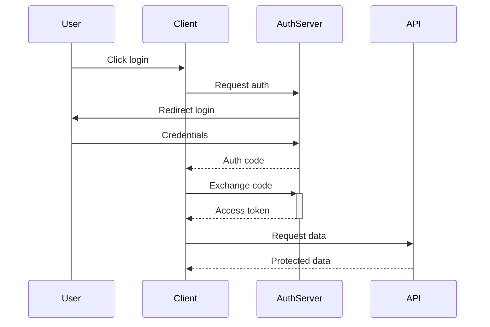
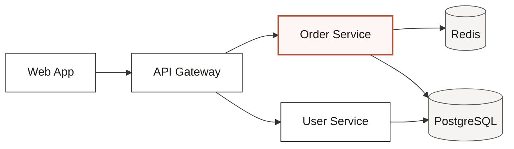
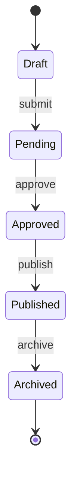
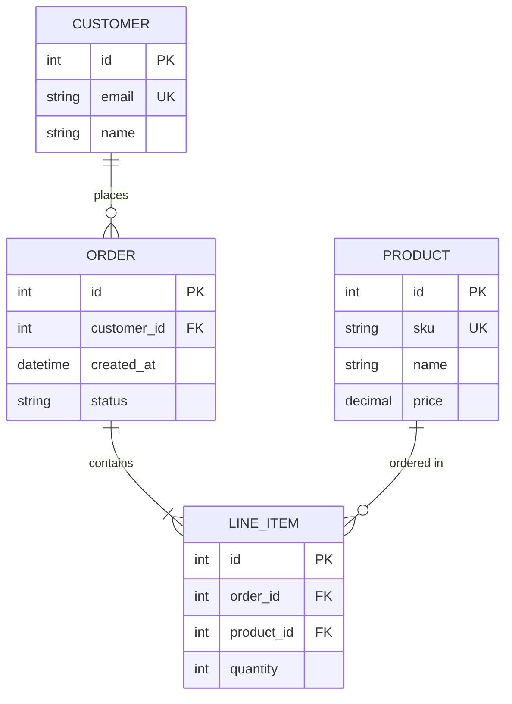
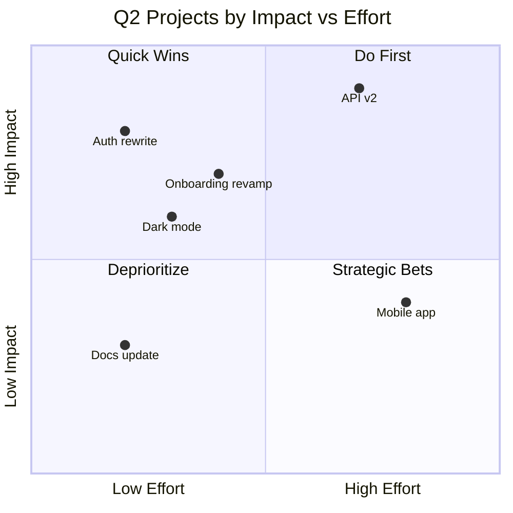
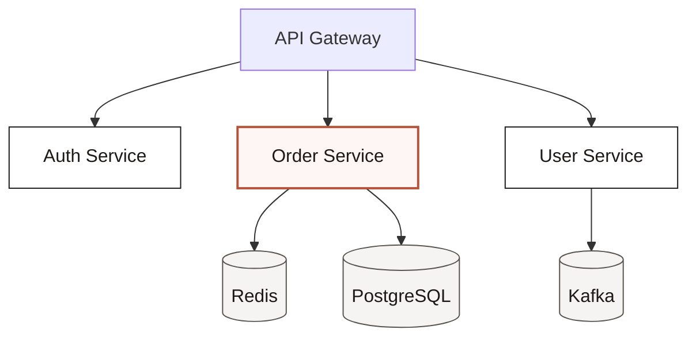
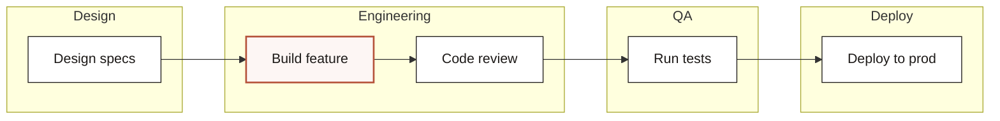
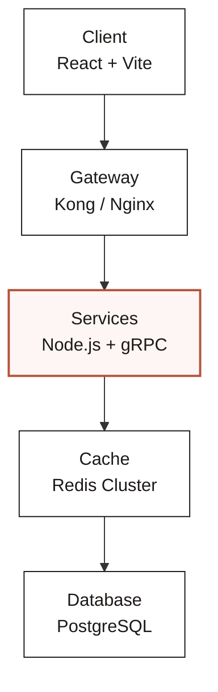
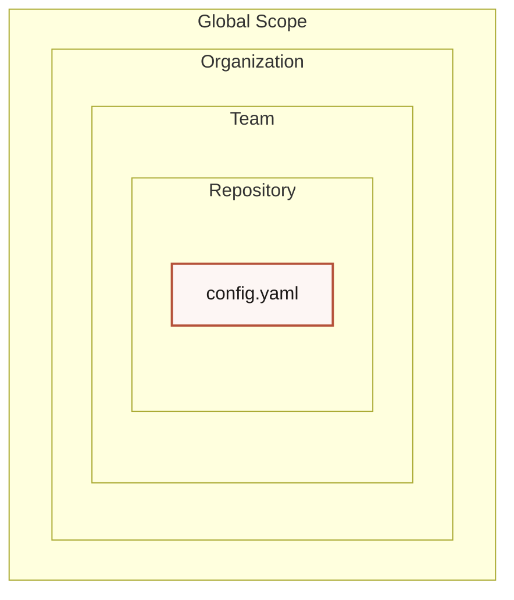

# Mermaid Design

**Editorial-quality diagrams as portable Mermaid code.**

Eleven diagram types. One shared design system, complexity budget, and taste gate. Renders everywhere — GitHub, Notion, Obsidian, GitLab, VS Code, and any Markdown viewer that supports Mermaid.

Inspired by [cathrynlavery/diagram-design](https://github.com/cathrynlavery/diagram-design) — editorial diagram philosophy adapted for Mermaid.js.

---

## What it makes

| Type | Best for | Mermaid syntax |
|---|---|---|
| **Flowchart** | Decision logic, algorithms, branching flows | `graph TD` |
| **Sequence** | Request/response, protocol exchanges, API traces | `sequenceDiagram` |
| **Architecture** | System overviews, data-flow, integration maps | `graph LR` / `architecture-beta` |
| **State machine** | Order status, auth state, connection lifecycle | `stateDiagram-v2` |
| **ER / data model** | Database schemas, API resource relationships | `erDiagram` |
| **Timeline** | Release history, milestones, roadmaps | `timeline` |
| **Quadrant** | Prioritization, 2×2 positioning, portfolio maps | `quadrantChart` |
| **Tree** | Org charts, dependency trees, taxonomy | `graph TD` / `mindmap` |
| **Swimlane** | Cross-functional processes, handoffs | `graph TD` + `subgraph` |
| **Layer stack** | OSI model, tech stack, abstraction layers | `graph TB` / `block-beta` |
| **Nested** | Scope boundaries, containment hierarchies | `graph TD` + `subgraph` |

All diagrams ship with an editorial palette (warm paper, ink, coral accent) and a pre-output taste gate.

---

## Install

This skill uses the **open SKILL.md standard** — a single `SKILL.md` file with YAML frontmatter inside a named folder. It works natively across Claude Code, OpenCode, GitHub Copilot CLI (Codex), Antigravity, and any other agent that follows the same convention. No separate versions needed.

### Claude Code

**Skills directory:**
```bash
git clone git@github.com:iamvaleriofantozzi/mermaid-design.git ~/.claude/skills/mermaid-design
```
Restart Claude Code. The skill registers as `mermaid-design`.

**Plugin marketplace:**
```bash
/plugin marketplace add iamvaleriofantozzi/mermaid-design
/plugin install mermaid-design@mermaid-design
```

### OpenCode / Paseo

```bash
git clone git@github.com:iamvaleriofantozzi/mermaid-design.git ~/.config/opencode/skills/mermaid-design
# or
ln -s ~/.claude/skills/mermaid-design ~/.config/opencode/skills/mermaid-design
```
OpenCode also searches `.claude/skills/` and `.agents/skills/` automatically, so sharing the same clone with Claude Code works out of the box.

### GitHub Copilot CLI (Codex)

**Project-level** (inside your repo):
```bash
git clone git@github.com:iamvaleriofantozzi/mermaid-design.git .github/skills/mermaid-design
# or
ln -s ~/.claude/skills/mermaid-design .github/skills/mermaid-design
```

**Personal** (global):
```bash
git clone git@github.com:iamvaleriofantozzi/mermaid-design.git ~/.copilot/skills/mermaid-design
# or
ln -s ~/.claude/skills/mermaid-design ~/.copilot/skills/mermaid-design
```
Run `/skills reload` in the CLI if already open.

### Antigravity

**Project-level:**
```bash
git clone git@github.com:iamvaleriofantozzi/mermaid-design.git .agents/skills/mermaid-design
```

**Global:**
```bash
git clone git@github.com:iamvaleriofantozzi/mermaid-design.git ~/.gemini/antigravity/skills/mermaid-design
```

### Manual use

You don't need an AI agent to use this. Copy any example from [`examples/`](examples/) and paste it into the [Mermaid Live Editor](https://mermaid.live/).

---

## Quickstart

```
Make me a flowchart of the login flow: start, validate input, check credentials,
return token or error.
```

Your agent will pick the right type, build the Mermaid code, and output it wrapped in triple backticks. Paste it into GitHub, Notion, Obsidian, or any Mermaid-compatible viewer.

```
Make me a sequence diagram of the OAuth handshake in dark mode.
```

The agent will use the dark token palette and set the init block accordingly.

---

## Design system

- **One accent** (coral/rust) on 1–2 focal elements max.
- **Warm paper** background, **ink** text, **muted** secondary lines.
- **Sans-serif** for names, **monospace** for technical sublabels (ports, URLs, field types).
- **No shadows, no gradients, no neon glow.**
- **Complexity budget**: max 9 nodes, max 12 arrows, max 2 focal elements.

Full spec in [`references/style-guide.md`](references/style-guide.md).

---

## Architecture

Progressive disclosure. `SKILL.md` is a lean index — it tells the agent how to pick a type and where to look for detail. Every type lives in its own reference file, loaded only when relevant.

```
mermaid-design/
├── SKILL.md                    # Philosophy, selection guide, taste gate
├── references/
│   ├── style-guide.md          # Colors, typography, tokens
│   ├── mermaid-config.md       # Init blocks, classDef, viewer compatibility
│   ├── type-flowchart.md
│   ├── type-sequence.md
│   ├── type-architecture.md
│   ├── type-state.md
│   ├── type-er.md
│   ├── type-timeline.md
│   ├── type-quadrant.md
│   ├── type-tree.md
│   ├── type-swimlane.md
│   ├── type-layers.md
│   └── type-nested.md
├── examples/                   # One working .mmd per type
└── README.md
```

This keeps the agent's working context tight (only load what you need) and makes the skill easy to extend.

---

## Viewer compatibility

| Feature | GitHub | Notion | Obsidian | GitLab | VS Code |
|---|---|---|---|---|---|
| `%%{init}%%` | ✅ | ✅ | ✅ | ✅ | ✅ |
| `theme: base` | ✅ | ✅ | ✅ | ✅ | ✅ |
| `classDef` (flowchart/sequence/state) | ✅ | ✅ | ✅ | ✅ | ✅ |
| `architecture-beta` | ❓ | ❓ | ❓ | ❓ | ✅ |
| `quadrantChart` | ✅ | ✅ | ✅ | ✅ | ✅ |
| `timeline` | ✅ | ✅ | ✅ | ✅ | ✅ |
| `mindmap` | ❓ | ❓ | ✅ | ❓ | ✅ |
| `block-beta` | ❓ | ❓ | ❓ | ❓ | ✅ |

For maximum portability, prefer `graph TD`, `sequenceDiagram`, `stateDiagram-v2`, `erDiagram`, `quadrantChart`, and `timeline`.

---

## When not to use this

- **Quick unicode diagrams** for tweets or terminal output → wiretext.
- **Lists of anything** → a table or bullets.
- **Before/after comparisons** → a table.
- **One-shape "diagrams"** — a single box with a label → just write the sentence.

Before drawing, ask: *Would a reader learn more from this than from a well-written paragraph?* If no, don't draw.

---

## Examples

### Flowchart — User login flow with validation

**Scenario:** A user submits credentials, passes format and password checks, optionally completes 2FA, and is granted a session—or rejected at any failure gate.


---

### Sequence — OAuth2 handshake (4 actors)

**Scenario:** A user initiates login through a client, the authorization server issues a code and exchanges it for an access token, and the client calls a protected API.



---

### Architecture — Web app → API → services → database

**Scenario:** A single-page web app reaches an API gateway that routes traffic to domain services, each reading from a shared PostgreSQL database and a Redis cache.



---

### State — Order lifecycle

**Scenario:** An order moves from draft to pending approval, then through publish to archive, with each transition triggered by an explicit business event.



---

### ER — E-commerce model

**Scenario:** A customer places orders containing line items, each line item linking to a product, forming a normalized e-commerce domain model.



---

### Timeline — Product roadmap 2023–2024

**Scenario:** A startup ships a public beta in 2023, releases v1.0 and enterprise features in 2024, and closes a Series A by year end.


---

### Quadrant — Q2 projects by Impact vs Effort

**Scenario:** Six proposed Q2 initiatives are plotted to reveal quick wins, strategic bets, and items that should be deferred.



---

### Tree — API gateway dependency tree

**Scenario:** The API gateway fans out to three downstream services, with the order service depending on Redis and PostgreSQL, and the user service depending on Kafka.



---

### Swimlane — Design → Engineering → QA → Deploy

**Scenario:** A feature moves through four functional lanes, from design specs to production deployment, with code review and testing as explicit gates.



---

### Layer stack — Full-stack application layers

**Scenario:** A modern stack is shown as five descending layers, from the React client down through gateway, services, cache, and PostgreSQL.



---

### Nested — Config cascade (Global → Org → Team → Repo)

**Scenario:** Configuration resolution narrows from global defaults through organization and team scopes, ending at the most specific repository-level file.



---

## License

MIT
