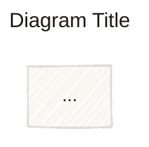

# Mermaid Config Reference

Centralized reference for `%%{init}%%` blocks, `classDef` patterns, and per-type `themeVariables`. Load this whenever you need to configure a diagram's look.

---

## Init block pattern

Every diagram must start with an init block that sets `theme: base`. This prevents the viewer's default theme from overriding your editorial palette.

### Universal template

```mermaid
%%{init: {
  'theme': 'base',
  'themeVariables': {
    'primaryColor': '<paper>',
    'primaryTextColor': '<ink>',
    'primaryBorderColor': '<ink>',
    'lineColor': '<muted>',
    'secondaryColor': '<paper-2>',
    'tertiaryColor': '#ffffff',
    'fontFamily': '<sans-stack>'
  }
}%%
```

Replace placeholders with values from [`style-guide.md`](style-guide.md).

### Dark mode variant

```mermaid
%%{init: {
  'theme': 'base',
  'themeVariables': {
    'primaryColor': '#1c1917',
    'primaryTextColor': '#faf7f2',
    'primaryBorderColor': '#faf7f2',
    'lineColor': '#a8a29e',
    'secondaryColor': '#292524',
    'tertiaryColor': '#1c1917',
    'fontFamily': '<sans-stack>'
  }
}%%
```

> **Warning:** `theme: dark` often overrides custom variables. Always use `theme: base` with explicit dark tokens for full control.

### Hand-drawn look

Add `look: handDrawn` to any init block:

```mermaid
%%{init: {
  'theme': 'base',
  'look': 'handDrawn',
  'themeVariables': { ... }
}%%
```

Good for essays, presentations, and informal docs. Avoid for technical architecture diagrams.

---

## classDef library

Define these **once per diagram**, after the init block and before the graph body. Apply with `class NodeName focal;`.

### Editorial palette classDefs

```mermaid
classDef focal fill:rgba(181,82,58,0.08),stroke:#b5523a,stroke-width:2px,color:#1c1917;
classDef backend fill:#ffffff,stroke:#1c1917,stroke-width:1px,color:#1c1917;
classDef store fill:rgba(28,25,23,0.05),stroke:#57534e,stroke-width:1px,color:#1c1917;
classDef external fill:rgba(28,25,23,0.03),stroke:rgba(28,25,23,0.30),stroke-width:1px,color:#1c1917;
classDef input fill:rgba(87,83,78,0.10),stroke:#78716c,stroke-width:1px,color:#1c1917;
classDef optional fill:rgba(28,25,23,0.02),stroke:rgba(28,25,23,0.20),stroke-width:1px,stroke-dasharray: 4 3,color:#78716c;
classDef security fill:rgba(181,82,58,0.05),stroke:rgba(181,82,58,0.50),stroke-width:1px,stroke-dasharray: 4 4,color:#1c1917;
classDef link stroke:#2563eb,color:#2563eb;
```

### Dark mode classDefs

```mermaid
classDef focal fill:rgba(214,114,74,0.10),stroke:#d6724a,stroke-width:2px,color:#faf7f2;
classDef backend fill:#292524,stroke:#faf7f2,stroke-width:1px,color:#faf7f2;
classDef store fill:rgba(250,247,242,0.05),stroke:#a8a29e,stroke-width:1px,color:#faf7f2;
classDef external fill:rgba(250,247,242,0.03),stroke:rgba(250,247,242,0.30),stroke-width:1px,color:#faf7f2;
classDef input fill:rgba(168,162,158,0.10),stroke:#8e8680,stroke-width:1px,color:#faf7f2;
classDef optional fill:rgba(250,247,242,0.02),stroke:rgba(250,247,242,0.20),stroke-width:1px,stroke-dasharray: 4 3,color:#8e8680;
classDef security fill:rgba(214,114,74,0.05),stroke:rgba(214,114,74,0.50),stroke-width:1px,stroke-dasharray: 4 4,color:#faf7f2;
classDef link stroke:#60a5fa,color:#60a5fa;
```

---

## Per-type themeVariables

Mermaid uses **different variable names** for each diagram type. Below are the correct `themeVariables` keys for each type in mermaid-design.

### flowchart / graph

```json
{
  "primaryColor": "#faf7f2",
  "primaryTextColor": "#1c1917",
  "primaryBorderColor": "#1c1917",
  "lineColor": "#57534e",
  "secondaryColor": "#f2ede4",
  "tertiaryColor": "#ffffff",
  "fontFamily": "Geist, sans-serif"
}
```

Additional flowchart-specific variables (optional):

```json
{
  "clusterBkg": "#f2ede4",
  "clusterBorder": "rgba(28,25,23,0.12)",
  "edgeLabelBackground": "#faf7f2",
  "nodeTextColor": "#1c1917"
}
```

### sequenceDiagram

```json
{
  "actorBkg": "#faf7f2",
  "actorBorder": "#1c1917",
  "actorTextColor": "#1c1917",
  "actorLineColor": "#57534e",
  "signalColor": "#1c1917",
  "signalTextColor": "#1c1917",
  "labelBoxBkgColor": "#faf7f2",
  "labelBoxBorderColor": "#57534e",
  "labelTextColor": "#1c1917",
  "loopTextColor": "#1c1917",
  "noteBorderColor": "#57534e",
  "noteBkgColor": "#f2ede4",
  "noteTextColor": "#1c1917",
  "activationBorderColor": "#57534e",
  "activationBkgColor": "#f2ede4",
  "fontFamily": "Geist, sans-serif"
}
```

### stateDiagram-v2

```json
{
  "primaryColor": "#faf7f2",
  "primaryTextColor": "#1c1917",
  "primaryBorderColor": "#1c1917",
  "lineColor": "#57534e",
  "secondaryColor": "#f2ede4",
  "tertiaryColor": "#ffffff",
  "fontFamily": "Geist, sans-serif"
}
```

### erDiagram

```json
{
  "primaryColor": "#faf7f2",
  "primaryTextColor": "#1c1917",
  "primaryBorderColor": "#1c1917",
  "lineColor": "#57534e",
  "secondaryColor": "#f2ede4",
  "tertiaryColor": "#ffffff",
  "fontFamily": "Geist, sans-serif"
}
```

> Note: `erDiagram` has limited `themeVariables` support. `classDef` does not apply. Focus on simplicity and clean entity naming.

### timeline

```json
{
  "primaryColor": "#faf7f2",
  "primaryTextColor": "#1c1917",
  "primaryBorderColor": "#1c1917",
  "lineColor": "#57534e",
  "secondaryColor": "#f2ede4",
  "tertiaryColor": "#ffffff",
  "fontFamily": "Geist, sans-serif"
}
```

### quadrantChart

```json
{
  "primaryColor": "#faf7f2",
  "primaryTextColor": "#1c1917",
  "primaryBorderColor": "#1c1917",
  "lineColor": "#57534e",
  "secondaryColor": "#f2ede4",
  "tertiaryColor": "#ffffff",
  "fontFamily": "Geist, sans-serif"
}
```

> `quadrantChart` does not support `classDef`. Focal items must be indicated via position (top-right = "do first") and naming, not color.

### architecture-beta

```json
{
  "primaryColor": "#faf7f2",
  "primaryTextColor": "#1c1917",
  "primaryBorderColor": "#1c1917",
  "lineColor": "#57534e",
  "secondaryColor": "#f2ede4",
  "tertiaryColor": "#ffffff",
  "fontFamily": "Geist, sans-serif"
}
```

> `architecture-beta` is experimental and may not support all `themeVariables` consistently across viewers.

---

## Viewer compatibility notes

Not all Mermaid features work everywhere. Use this table to decide what is safe.

| Feature | GitHub | Notion | Obsidian | GitLab | VS Code |
|---|---|---|---|---|---|
| `%%{init}%%` | ✅ | ✅ | ✅ | ✅ | ✅ |
| `theme: base` | ✅ | ✅ | ✅ | ✅ | ✅ |
| `look: handDrawn` | ❌ | ❓ | ✅ | ❓ | ✅ |
| `classDef` in flowchart | ✅ | ✅ | ✅ | ✅ | ✅ |
| `classDef` in sequence | ✅ | ✅ | ✅ | ✅ | ✅ |
| `classDef` in stateDiagram | ✅ | ✅ | ✅ | ✅ | ✅ |
| `classDef` in erDiagram | ❌ | ❌ | ❌ | ❌ | ❌ |
| `architecture-beta` | ❓ | ❓ | ❓ | ❓ | ✅ |
| `quadrantChart` | ✅ | ✅ | ✅ | ✅ | ✅ |
| `timeline` | ✅ | ✅ | ✅ | ✅ | ✅ |
| `block-beta` | ❓ | ❓ | ❓ | ❓ | ✅ |
| `mindmap` | ❓ | ❓ | ✅ | ❓ | ✅ |

**Legend:** ✅ Supported | ❌ Not supported | ❓ Untested or partial

**Rule:** For maximum portability, prefer `flowchart`, `sequenceDiagram`, `stateDiagram-v2`, `erDiagram`, `quadrantChart`, and `timeline`. Use `architecture-beta`, `block-beta`, and `mindmap` only when the viewer is known to support them.

---

## Frontmatter (optional)

For deployment on self-hosted sites or the Mermaid Live Editor, you can use YAML frontmatter for configuration:



Frontmatter is **not supported** on GitHub. Use `%%{init}%%` for universal compatibility.
