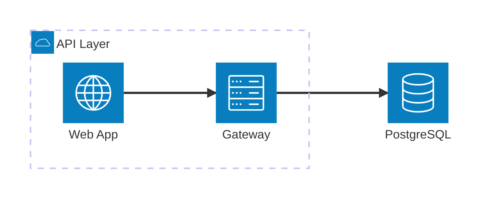
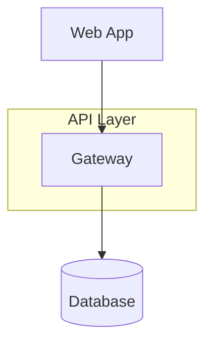

# Architecture

**Best for:** system overviews, data-flow diagrams, integration maps, infra topology.

## Syntax

Use `architecture-beta` (Mermaid 10.9+) or fall back to `graph TD` with `subgraph` for broader compatibility.

### architecture-beta (preferred when supported)



**Keywords:**
- `service id(icon)[Label]` — a node with an icon.
- `group id(icon)[Label]` — a boundary/container.
- `service ... in group` — places a service inside a group.
- `id:Direction --> Direction:id` — connection between services.

**Icons:** `internet`, `server`, `database`, `cloud`, `disk`, `mobile`, `laptop`, `email`, `firewall`, etc.

### Fallback: graph TD with subgraph

Use this when the viewer does not support `architecture-beta` (e.g., older GitHub, some GitLab instances).



## Layout conventions

- Group components by **tier or trust boundary** (frontend → backend → data; public → private).
- Primary flow runs **left→right** or **top→down**. Pick one and hold it.
- 1–2 coral focal nodes: the primary integration point, the primary data store, or the key decision node.
- Dashed boundaries for regions (use `subgraph` with dashed border via `classDef` or `architecture-beta` groups).

## Anti-patterns

- Every box in coral — hierarchy collapses.
- Bidirectional arrow when one direction is obvious from context.
- Mixing `architecture-beta` and `graph` syntax in the same diagram.

## Example (architecture-beta)


## Example fallback (graph TD)

```mermaid
%%{init: {
  'theme': 'base',
  'themeVariables': {
    'primaryColor': '#faf7f2',
    'primaryTextColor': '#1c1917',
    'primaryBorderColor': '#1c1917',
    'lineColor': '#57534e',
    'secondaryColor': '#f2ede4',
    'tertiaryColor': '#ffffff',
    'fontFamily': 'Geist, sans-serif'
  }
}%%
graph LR
    classDef focal fill:rgba(181,82,58,0.08),stroke:#b5523a,stroke-width:2px,color:#1c1917;
    classDef backend fill:#ffffff,stroke:#1c1917,stroke-width:1px,color:#1c1917;
    classDef store fill:rgba(28,25,23,0.05),stroke:#57534e,stroke-width:1px,color:#1c1917;

    Web[Web App] --> API[API Gateway]
    API --> SVC[Order Service]
    SVC --> Cache[(Redis)]
    SVC --> DB[(PostgreSQL)]

    class SVC focal;
    class Cache store;
    class DB store;

%% Legend:
%% ■ Focal (coral) — primary service
%% □ Backend — service / API
%% ▤ Store — database / cache
```

## Viewer note

`architecture-beta` is supported in VS Code, Mermaid Live Editor, and recent Mermaid.js deployments. **GitHub support is uncertain** — test before relying on it. Always provide the `graph TD` fallback if portability is critical.
