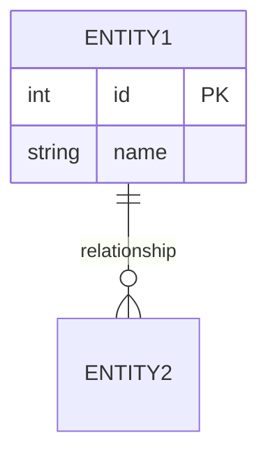
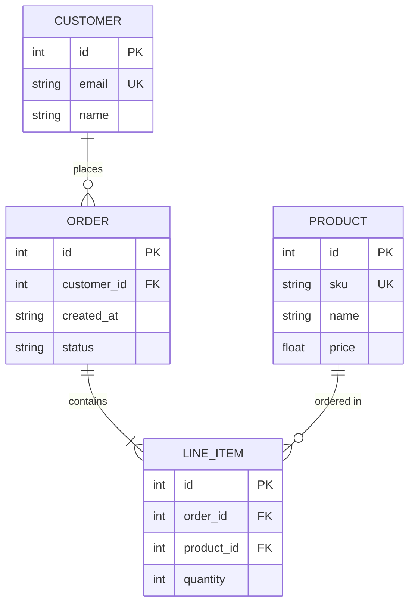

# ER / Data Model

**Best for:** database schemas, API resource relationships, domain models.

## Syntax

**Relationship notation:**

| Syntax | Cardinality |
|---|---|
| `||--||` | One to exactly one |
| `||--o{` | One to zero or many |
| `||--|{` | One to one or many |
| `}o--o{` | Zero or many to zero or many |
| `}|..|{` | Zero or many to zero or many (dotted) |

**Attribute markers:**
- `PK` — primary key
- `FK` — foreign key
- `UK` — unique key

## Layout conventions

- Each entity has a name and a field list. Keep field names concise.
- Group related entities close; Mermaid's layout engine places them automatically, but naming order affects initial placement.
- Relationships: place cardinality labels near the entity they describe.
- Coral on the aggregate root or central entity of the model. `erDiagram` does **not** support `classDef`, so focal emphasis must be achieved through naming, position (central placement), or relationship density.
- Limit to ~8 entities. Beyond that, split into bounded contexts.

## Anti-patterns

- Drawing a relationship line for every FK on a model with dozens — lay out by cluster instead.
- Inconsistent cardinality notation between ends of the same relationship.
- Fields padded to equal-height boxes — Mermaid handles height automatically.
- Technical jargon in entity names — use domain language.

## Example

## Note on styling

`erDiagram` has **limited** `themeVariables` support and **does not support** `classDef`. Do not use an `%%{init}%%` block with custom `themeVariables` — it is often ignored and may cause "Invalid Mermaid code" on some viewers. Keep the diagram clean through:
1. **Naming** — the aggregate root should have the clearest, most central name.
2. **Relationship density** — the focal entity has the most connections.
3. **Comments** — use `%%` to explain the focal model below the diagram.
