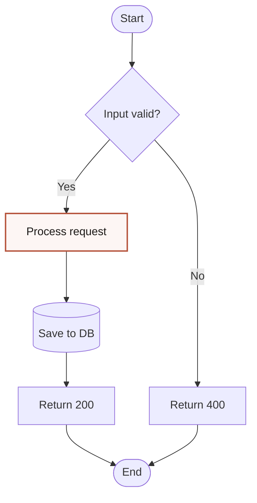

# Flowchart

**Best for:** decision logic, algorithms, user-facing branching flows ("Should I…?"), onboarding routing, support-triage trees.

## Syntax

Use `graph TD` (top-down) or `graph LR` (left-right). `flowchart` keyword is also valid but `graph` is more universally supported.

### Shape grammar

| Shape | Syntax | Meaning |
|---|---|---|
| Oval | `A([Start])` | Start / end |
| Rectangle | `B[Step]` | Step / action |
| Diamond | `C{Decision?}` | Decision (≤3 exits) |
| Circle | `D((Node))` | Merge point or hub |
| Stadium | `E([Label])` | Rounded rectangle (variant) |
| Subgraph | `subgraph Name ... end` | Grouping / boundary |

### Arrow grammar

| Type | Syntax | Usage |
|---|---|---|
| Solid | `-->` | Default flow |
| Dashed | `-.->` | Optional / return / async |
| Thick | `==>` | Strong emphasis (happy path) |
| Labeled | `-->|Yes| B` | Decision branches |
| Bidirectional | `<-->` | Avoid — use two unidirectional arrows if needed |

## Layout conventions

- Flow runs **top→down** (`TD`) for decision trees; **left→right** (`LR`) for linear pipelines.
- From a diamond, conventional exits: Yes to the right, No below — but **label every outgoing arrow** regardless.
- Use coral (`classDef focal`) on the happy path **or** on the single most consequential decision — never on every decision.
- Draw the simplest path first, then add branches.
- Keep diamond exits ≤3. If you need 4+ exits, refactor into nested diamonds.

## Anti-patterns

- Using fill color to signal node type — **shape does that**. Don't add `classDef` that replicates shape semantics.
- Decision diamond with 4+ exits.
- Unlabeled decision branches.
- Cyclic flowcharts without a clear termination node — readers get lost.

## Example

## Variants

- **Minimal** — diagram body only, no title inside the Mermaid block.
- **Full editorial** — wrap with Markdown H2 title and 1-sentence summary below the block.
