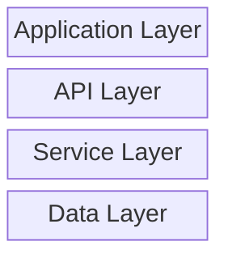
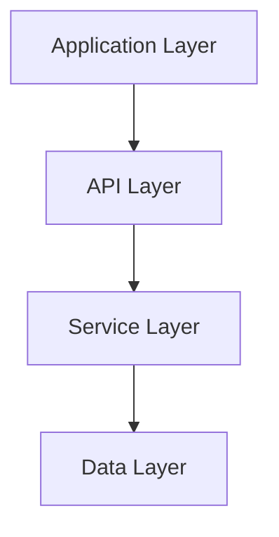
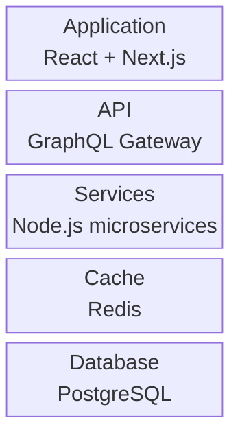
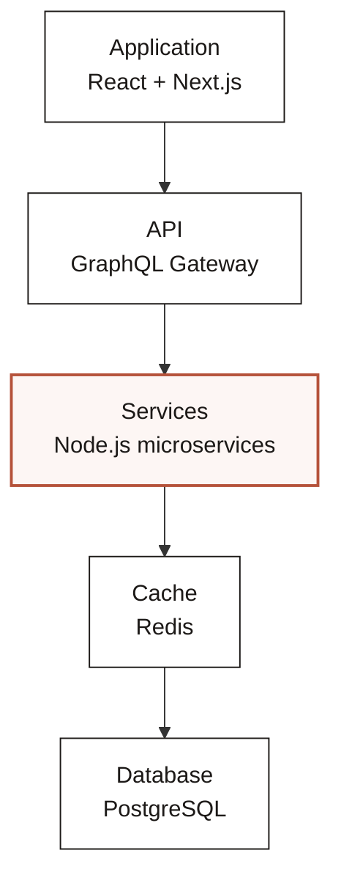

# Layer Stack

**Best for:** OSI model, CSS cascade, context hierarchy, tech stack, abstraction layers, memory hierarchy.

## Syntax

Use `block-beta` (Mermaid 10.6+) or fall back to `graph TD` with stacked nodes.

### block-beta (preferred when supported)

**Keywords:**
- `columns N` — sets the number of columns.
- `id["Label"]` — a block.
- `id:rowspan` — spans multiple rows (optional).

### Fallback: graph TB

## Layout conventions

- 4–6 layers total.
- Each layer is a full-width block or node. Label clearly.
- Direction indicator: if the stack has a semantic direction (e.g., abstraction ↑, packets ↓), mention it in the diagram title or a note.
- Coral on **one** focal layer — the bottleneck, the pay-rent layer, or the one under discussion.
- In `block-beta`, use `columns 1` for a vertical stack. Labels sit inside blocks automatically.

## Anti-patterns

- Layers that aren't actually hierarchical — use swimlane or architecture instead.
- Skipped numbering (missing L4 between L3 and L5 without explanation).
- Every layer a different color — hierarchy becomes invisible.
- Inconsistent layer heights without reason.

## Limitations

- `block-beta` does not support `classDef` in all viewers. Focal emphasis may rely on naming or position.
- `block-beta` is not supported on GitHub as of early 2025. Use the `graph TB` fallback for maximum portability.

## Example (block-beta)

## Example fallback (graph TB)

