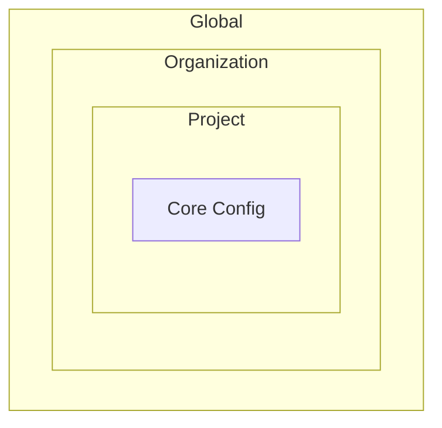
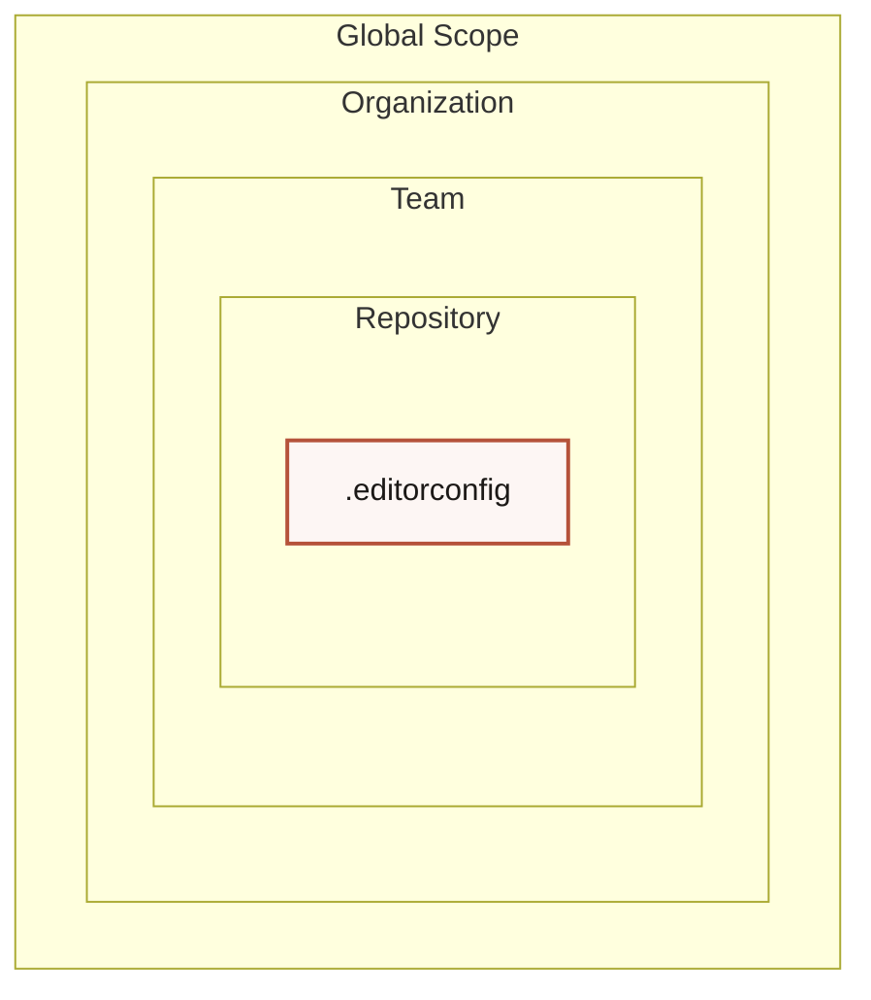

# Nested Containment

**Best for:** hierarchy through containment — scope boundaries, config cascade, trust zones, folder nesting, blast radius. Outer = broader, inner = more specific.

## Syntax

Use `graph TD` + nested `subgraph` blocks. Mermaid supports nesting `subgraph` inside `subgraph` up to 2–3 levels reliably.

## Layout conventions

- 3–5 levels of nesting. Mermaid handles nesting visually with nested boxes.
- Each level labeled clearly. The outermost label should describe the broadest scope.
- Stroke hierarchy: Mermaid applies the same stroke to all subgraph borders by default. Use `classDef` on subgraph labels (nodes inside) to create visual hierarchy.
- Fills: `subgraph` background colors can be set via `themeVariables.clusterBkg` and `clusterBorder`, but individual subgraph colors are not configurable per-subgraph in most viewers.
- Coral on the innermost focal node, not the container itself.

## Anti-patterns

- More than 5 levels of nesting — information disappears inward.
- Empty subgraphs — every container should have at least one node.
- Coral on multiple levels — hierarchy collapses.
- Using nested containment to show sequence or flow — that's a flowchart.

## Limitations

- Deep nesting (>3 levels) may break layout in some viewers or produce unreadable diagrams.
- `subgraph` styling is global via `themeVariables`. You cannot color individual subgraph borders differently in standard Mermaid.
- For very deep hierarchies, consider a `tree` diagram or a bulleted list instead.

## Example

