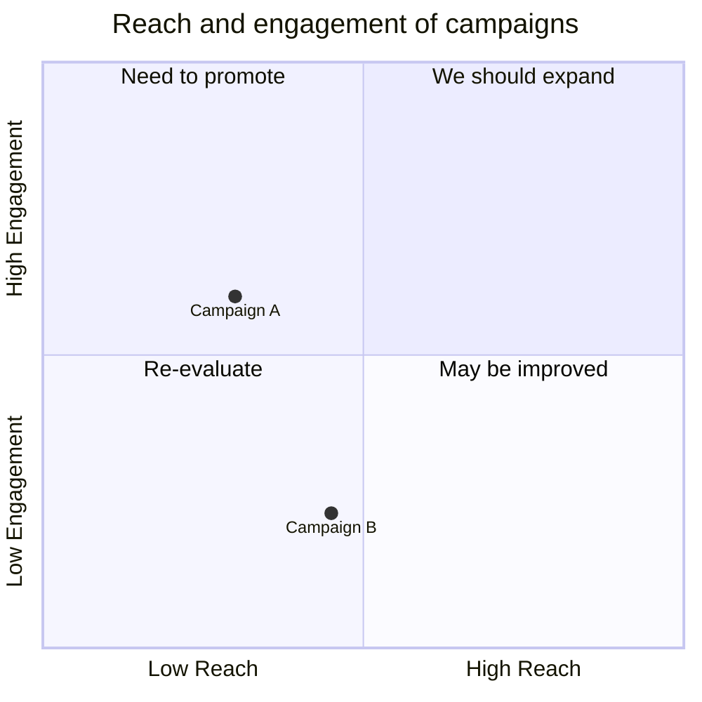
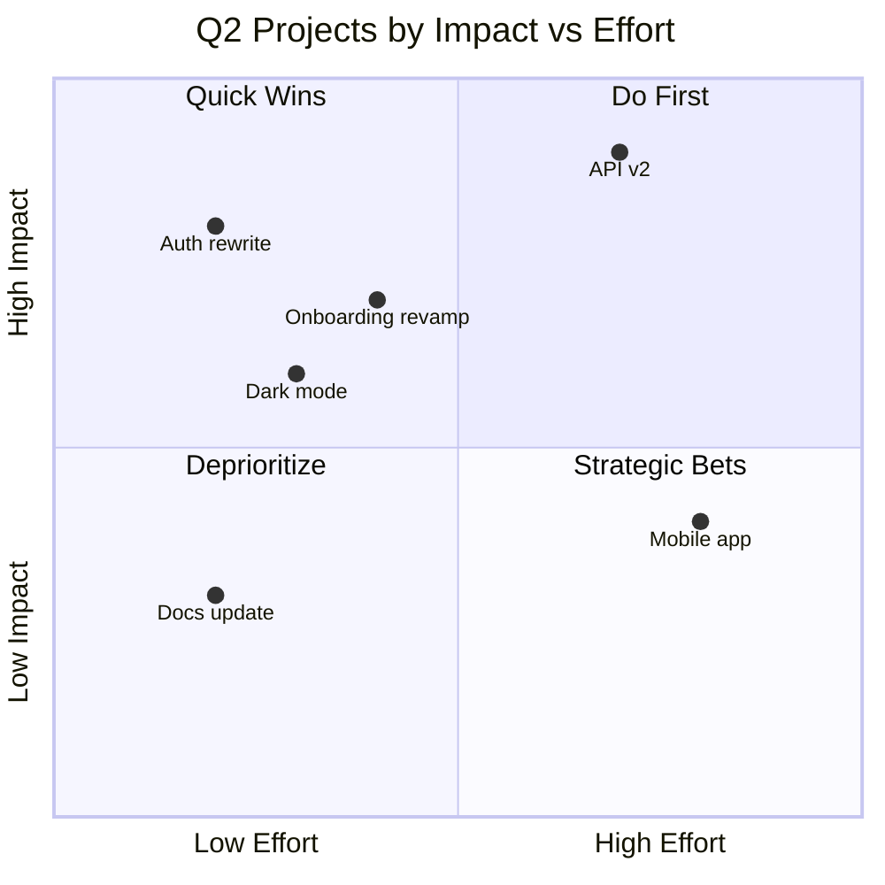

# Quadrant

**Best for:** prioritization (Impact × Effort), positioning (Reach × Frequency), portfolio maps, 2×2 decision frames.

## Syntax

**Keywords:**
- `title` — chart title.
- `x-axis Label --> Label` — horizontal axis. Left = low, right = high.
- `y-axis Label --> Label` — vertical axis. Bottom = low, top = high.
- `quadrant-N Label` — label for each quadrant (1 = top-right, 2 = top-left, 3 = bottom-left, 4 = bottom-right).
- `Item Name: [x, y]` — data point. x and y are 0.0–1.0.

## Layout conventions

- Axis labels at the ends, never at the midpoint.
- Items: small labeled dots positioned by `[x, y]`. Labels should not overlap.
- The "do first" item (typically top-right) is the natural focal point. No `classDef` needed — position is the signal.
- Limit to ~12 items. Cluster or split beyond that.
- Name items clearly; avoid cryptic acronyms.

## Anti-patterns

- Four filled quadrants in different colors — position + label does the work; color noise weakens it.
- Items placed exactly on axis lines (ambiguous quadrant). Offset slightly if needed.
- Missing axis names — readers can't interpret the chart.
- Too many items in one quadrant — the chart becomes a list.

## Example

## Note on focal signal

`quadrantChart` does not support individual point styling. The focal signal comes from:
1. **Position** — top-right is the implicit priority zone.
2. **Naming** — the most important item should have the clearest name.
3. **Quadrant label** — name quadrant-1 something active like "Do First" or "Ship Now".
