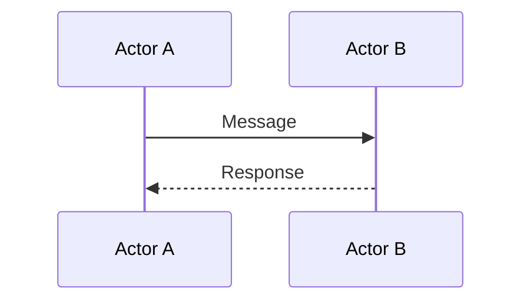
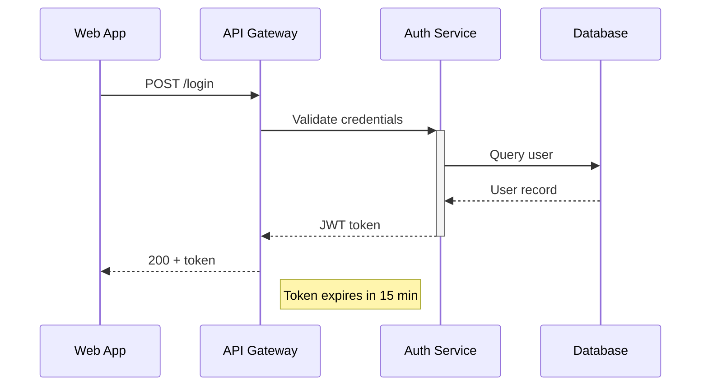

# Sequence

**Best for:** request/response flows, protocol exchanges, multi-actor interactions over time, API call traces, incident reconstructions.

## Syntax

### Message types

| Syntax | Meaning |
|---|---|
| `->>` | Solid arrow (sync call) |
| `-->>` | Dashed arrow (return / async) |
| `-x>` | Solid arrow with X (lost message) |
| `--x>` | Dashed arrow with X (lost return) |
| `->>+` | Activation start |
| `-->>-` | Activation end |
| `par ... and ... end` | Parallel messages |
| `loop ... end` | Loop block |
| `alt ... else ... end` | Alternative / if-else |
| `opt ... end` | Optional block |
| `Note over A,B: Text` | Note spanning actors |
| `Note right of A: Text` | Note beside actor |
| `rect rgb(181,82,58) ... end` | Colored background region |

## Layout conventions

- Actors declared in order of appearance with `participant X as "Label"`.
- Time flows **top→down**. Never draw an arrow pointing upward.
- **Activation bars**: use `+` and `-` to open/close. Stack for nested calls.
- Self-messages: `A->>A: Self call` — keep labels short.
- Return messages: dashed (`-->>`) in the same direction as the call.
- Coral on the primary success response or headline message — one, maybe two. Use `rect` with `accent-tint` background for emphasis regions.

## Anti-patterns

- Message arrow pointing *upward* — reverses time. Never.
- Activation bars that never close.
- Labels sitting over another lifeline — shorten or rephrase.
- More than 5 actors — split into two sequence diagrams or use an architecture diagram for overview.

## Example

## Variants

- **Minimal** — actors and messages only.
- **Full editorial** — add `Note` blocks for context, use `rect` to highlight the critical path.
