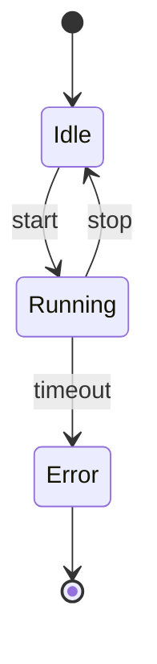
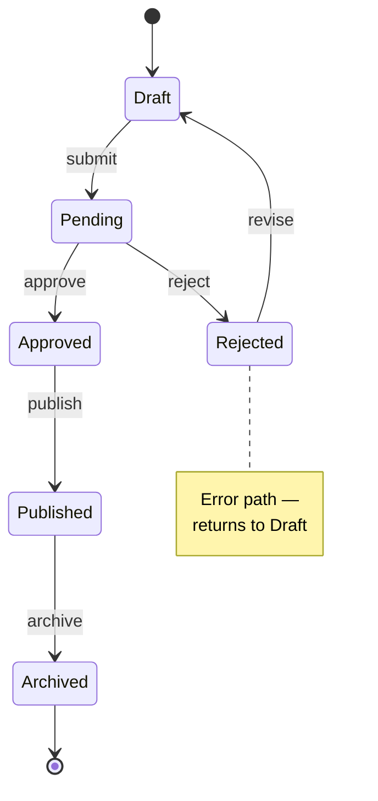

# State Machine

**Best for:** finite state logic — order status, auth state, connection lifecycle, form wizard, job queue status.

## Syntax

**Keywords:**
- `[*]` — start / end pseudo-state.
- `StateA --> StateB : event [guard]` — transition with optional label.
- `state Composite { ... }` — nested composite state.
- `state "Long Label" as S1` — alias for long names.

## Layout conventions

- States are rounded rectangles automatically. Labels in sans-serif via `themeVariables`.
- **Start**: `[*] --> State`. **End**: `State --> [*]`.
- Transitions labeled as `event [guard] / action` (omit sections you don't need).
- Self-loops: `State --> State : retry` — curves automatically.
- Orient along the dominant flow direction (left→right or top→down); Mermaid's Dagre engine handles layout, but declaring states in flow order improves readability.
- Coral on the state the reader should notice — typically the error state, or "happy completion". Use `classDef` if supported, otherwise rely on naming (`[Error 🚨]`).

## Anti-patterns

- More transitions than states × 2 → likely two state machines.
- "From any state" transitions drawn from every state — use a single annotation note instead: `Note right of State: * → Error on timeout`.
- Unlabeled transitions — the whole point is *what triggers this*.
- Composite states nested more than 2 levels deep — split into multiple diagrams.

## Example

## Variants

- **Minimal** — states and transitions only.
- **Full editorial** — add `Note` blocks to explain guards or business rules.
