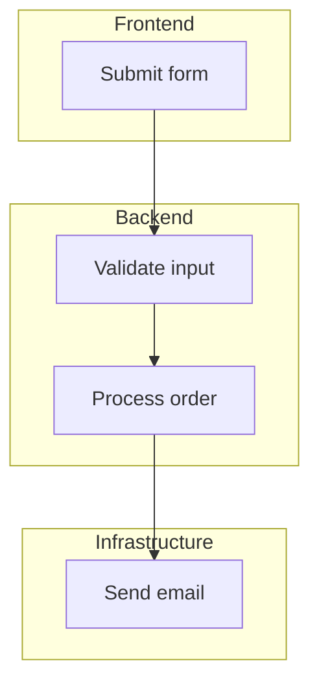

# Swimlane

**Best for:** cross-functional processes, RACI-style flows, vendor handoffs, multi-team shipping workflows.

## Syntax

Mermaid does **not** have a native swimlane diagram type. Emulate with `graph TD` + `subgraph` for lanes.



## Layout conventions

- Use `subgraph LaneName [Label]` to create lanes.
- Lanes can be arranged vertically (default) or horizontally (`graph LR` + `subgraph`).
- Process steps are nodes inside the lane of the actor performing them; arrows show flow.
- Handoffs (arrows crossing lane boundaries) are the most important edges — label them clearly.
- Don't force equal step count per lane; a lane with one step is fine.
- Coral on the handoff that introduces the most coupling or latency, or on the critical step.

## Anti-patterns

- Lanes without labels.
- A step drawn across two lanes — pick one owner.
- Arrows that snake back and forth — reorder steps so the flow is mostly straight.
- More than 5 lanes — split into multiple diagrams.
- Lanes with no steps inside — remove the lane.

## Limitations

- `subgraph` does not enforce strict lane boundaries visually. Mermaid may place nodes and arrows in ways that obscure the lane concept.
- For critical presentations where swimlane semantics must be crystal clear, consider exporting the Mermaid output to SVG and editing in a vector tool, or use a dedicated diagramming app.

## Example

```mermaid
%%{init: {
  'theme': 'base',
  'themeVariables': {
    'primaryColor': '#faf7f2',
    'primaryTextColor': '#1c1917',
    'primaryBorderColor': '#1c1917',
    'lineColor': '#57534e',
    'secondaryColor': '#f2ede4',
    'tertiaryColor': '#ffffff',
    'fontFamily': 'Geist, sans-serif'
  }
}%%
graph LR
    classDef focal fill:rgba(181,82,58,0.08),stroke:#b5523a,stroke-width:2px,color:#1c1917;
    classDef backend fill:#ffffff,stroke:#1c1917,stroke-width:1px,color:#1c1917;

    subgraph Design [Design]
        D1[Design mockups]
    end
    subgraph Engineering [Engineering]
        E1[Implement feature]
        E2[Code review]
    end
    subgraph QA [QA]
        Q1[Test feature]
    end
    subgraph DevOps [DevOps]
        O1[Deploy to prod]
    end

    D1 --> E1
    E1 --> E2
    E2 --> Q1
    Q1 --> O1

    class E1 focal;

%% Legend:
%% ■ Focal (coral) — critical implementation step
%% □ Step — standard process node
```
