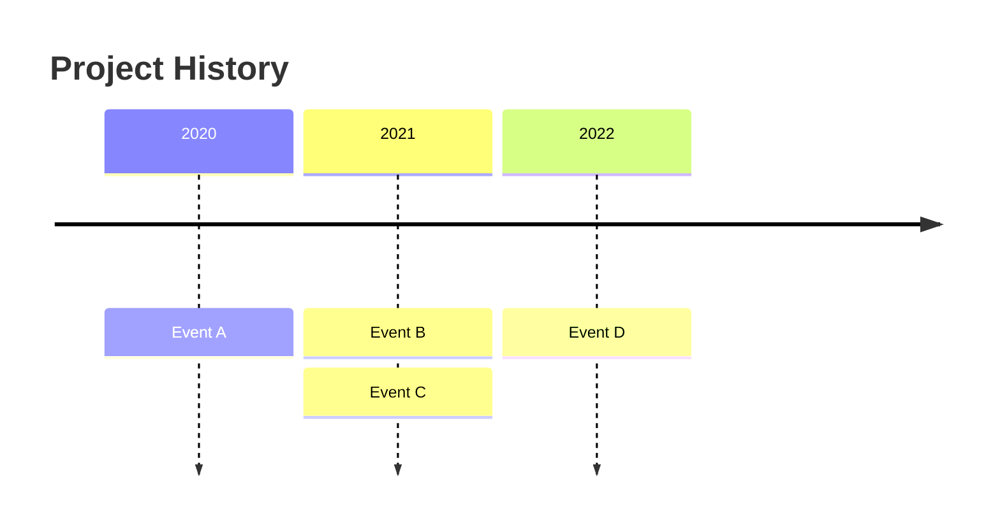
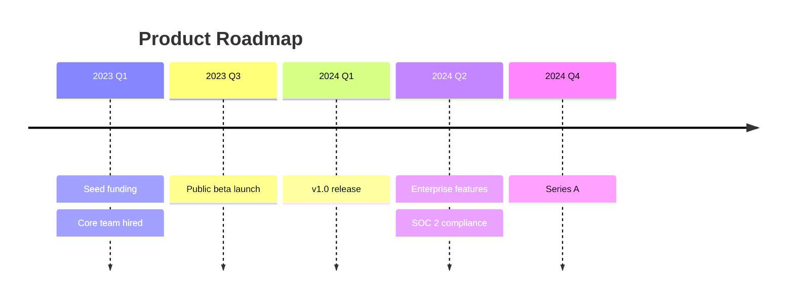

# Timeline

**Best for:** release history, project milestones, incident timelines, roadmaps, changelog visualizations.

## Syntax

**Keywords:**
- `title` — diagram title.
- `YYYY` or `Q1 2024` or `Month` — time section header.
- `:` — separates time marker from event description.
- Multiple events under the same time marker: repeat the marker or indent with `:` on a new line.

## Layout conventions

- Time flows **left→right** (horizontal) automatically.
- Events stack vertically under each time marker.
- Major milestones: place alone under their marker and use **bold** in the label (Mermaid renders markdown formatting in some viewers).
- Time scale must be honest: `timeline` uses equal spacing per marker. If intervals are non-equal, use descriptive markers (`Early 2023`, `Late 2023`) rather than forcing equal numeric spacing.
- Coral emphasis: `timeline` does not support `classDef`. Use **all-caps** or emoji (sparingly) to mark focal milestones.

## Anti-patterns

- Equal-spacing events that aren't equally spaced in time — use descriptive labels.
- Missing axis context ("what unit is this?") — always include a title.
- Crowded events without grouping — merge minor events or split into multiple timelines.

## Example

## Limitation

`timeline` is **linear and discrete**. It does not support branching, non-linear scales, or duration bars. For tasks with durations and dependencies, use `gantt` instead.

> **Note:** Do not use `%%{init}%%` with custom `themeVariables` in `timeline` — support is inconsistent across viewers and may produce "Invalid Mermaid code".
