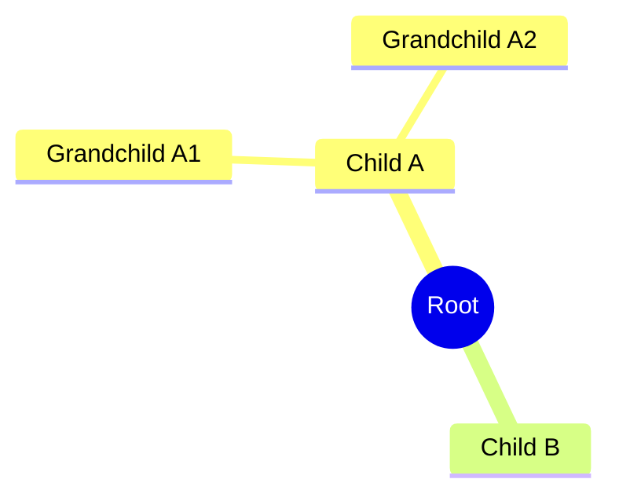
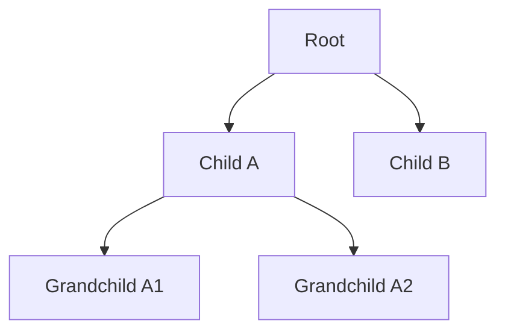
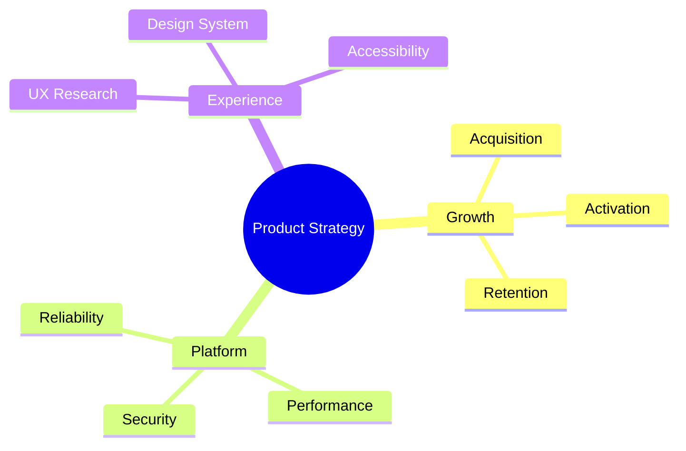

# Tree / Hierarchy

**Best for:** org charts, dependency trees, taxonomy, file trees, decision breakdowns, skill trees.

## Syntax

Two options in Mermaid. Pick based on the use case:

### Option A: mindmap (pure hierarchy, no technical labels)



**Pros:** Clean radial layout, minimal syntax, great for presentations.  
**Cons:** No `classDef`, no technical sublabels, limited control over node shapes.

### Option B: graph TD (technical trees with labels and styling)



**Pros:** Full `classDef` support, arrow labels, subgraphs, shapes.  
**Cons:** Linear layout; deep trees become wide or tall quickly.

## Decision guide

| If you need… | Use |
|---|---|
| Clean org chart / taxonomy | `mindmap` |
| Dependency tree with versions / ports | `graph TD` |
| File tree with types | `graph TD` + `classDef` |
| Decision breakdown with labels | `graph TD` |

## Layout conventions

- Root at top (`graph TD`) or center (`mindmap`).
- Max depth: 4 (root + 3 tiers). Max breadth per level: 5.
- In `graph TD`, connectors are straight lines; Mermaid does not support orthogonal elbow connectors natively.
- Coral on **one** node: root OR critical leaf. Not both.
- In `mindmap`, emphasis is via nesting depth and naming only.

## Anti-patterns

- Tree 5+ levels deep — illegible. Split.
- Mixing `mindmap` and `graph` syntax.
- Coral on root AND a leaf in the same `graph TD` diagram.
- Skipped levels (parent connected to grandchild with no middle node).

## Example (graph TD)

```mermaid
%%{init: {
  'theme': 'base',
  'themeVariables': {
    'primaryColor': '#faf7f2',
    'primaryTextColor': '#1c1917',
    'primaryBorderColor': '#1c1917',
    'lineColor': '#57534e',
    'secondaryColor': '#f2ede4',
    'tertiaryColor': '#ffffff',
    'fontFamily': 'Geist, sans-serif'
  }
}%%
graph TD
    classDef focal fill:rgba(181,82,58,0.08),stroke:#b5523a,stroke-width:2px,color:#1c1917;
    classDef backend fill:#ffffff,stroke:#1c1917,stroke-width:1px,color:#1c1917;

    API[API Gateway] --> Auth[Auth Service]
    API --> Order[Order Service]
    API --> User[User Service]
    Order --> Cache[(Redis)]
    Order --> DB[(PostgreSQL)]

    class Order focal;
    class Cache store;
    class DB store;

%% Legend:
%% ■ Focal (coral) — primary service
%% □ Backend — service
%% ▤ Store — database / cache
```

## Example (mindmap)


